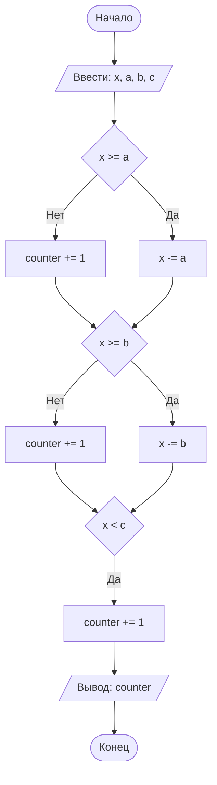

## Отчет по лабораторной работе № 1

#### № группы: `ПМ-2402`

#### Выполнил: `Бронников Святослав Викторович`

#### Вариант: `4`

### Cодержание:
- [Постановка задачи](#1-постановка-задачи)
- [Входные и выходные данные](#2-входные-и-выходные-данные)
- [Выбор структуры данных](#3-выбор-структуры-данных)
- [Алгоритм](#4-алгоритм)
- [Программа](#5-программа)
- [Анализ правильности решения](#6-анализ-правильности-решения)
### 1. Постановка задачи
>Трое жильцов решили выбросить в контейнер объемом X литров мусорные
пакеты объемом A, B, C литров соответственно. Они подходят к контейнеру в указанном порядке и пытаются поместить пакет в контейнер. Если
пакет не помещается в контейнер, жилец уносит свой пакет в другое место.
Скольким жильцам не удастся выкинуть мусор в указанный контейнер? На
вход программы подаются натуральные числа X, A, B, C.

1-ый шаг:
Проверить, не больше ли мешок А, чем объем контейнера Х
Если он больше, то к счетчику прибавляем единицу, так как мешок не помещается, а если не больше, то вычитаем из объема контейнера Х объем мешка А и обновляем Х  
2-ой шаг:
Проверить, не больше ли мешок B, чем оставшийся объем контейнера Х
Если он больше, то к счетчику прибавляем единицу, так как мешок не помещается, а если не больше, то вычитаем из объема контейнера Х объем мешка В и обновляем Х  
3-ий шаг:
Проверить, не больше ли мешок B, чем оставшийся объем контейнера Х
Если он больше, то к счетчику прибавляем единицу, так как мешок не помещается
### 2. Входные и выходные данные

#### Данные на вход
4 натуральных числа: X, A, B, C. Наименьшее натуральное число это 1, а наибольшее, которое способна хранить переменная типа `int` это 

|   | Тип                          | min значение | max значение     |
|---|------------------------------|--------------|------------------|
| X | Целое, положительное число   | 1            | 2<sup>31</sup>-1 |
| A | Целое, положительное число   | 1            | 2<sup>31</sup>-1 |
| B | Целое, положительное число   | 1            | 2<sup>31</sup>-1 |
| C | Целое, положительное число   | 1            | 2<sup>31</sup>-1 |
#### Данные на выход  
Так как по условию задачи всего имеется 3 пакета, количество непоместившихся пакетов не может быть отрицательным и не может быть больше 3  

|         | Тип                          | min значение | max значение |
|---------|------------------------------|--------------|--------------|
| counter | Целое, неотрицательное число | 0            | 3            |

### 3. Выбор структуры данных
Программа получает 4 натуральных числа, поэтому для их хранения можно выделить 4 переменных (`x`, `a`, `b` и `c`) типа `int`

|                                             | название переменной | Тип (в Java) |
|---------------------------------------------|---------------------|--------------|
| X (Объем контейнера)                        | `x`                 | `int`        |
| A (Объем пакета А)                          | `a`                 | `int`        |
| B (Объем пакета B)                          | `b`                 | `int`        |
| C (Объем пакета C)                          | `c`                 | `int`        |
| Счетчик (количество невместившихся пакетов) | `counter`           | `int`        |  

### 4. Алгоритм

#### Алгоритм выполнения программы:
1. **Ввод данных:**  
   Программа считывает четыре целых числа, обозначенные как `x`, `a`, `b` и `c`.

2. **Создание счетчика**  
Программа создает целочисленную переменную `counter`, и присваивает ей значение `0`.

3. **Проверка, помещается ли пакет в оставшееся свободное место в контейнере:**  
Программа проверяет, помещается ли пакет А в контейнер(Х). Если да, то присваивает Х новое значение, равное Х-А, иначе прибавляет к счетчику единицу.  
Аналогичная операция проделывается с пакетом В.  
Дальше программа проверяет, больше ли пакет С, чем остаток места в контейнере Х. Если да, то счетчик увеличивается на единицу.
4. **Вывод результата:**  
На экран выводится значение переменной `counter`.


### 5. Программа

```java
import java.io.PrintStream;
import java.util.Scanner;
public class Main {
    public static Scanner in = new Scanner(System.in); // Объявляем объект класса Scanner для ввода данных
    public static PrintStream out = System.out; // Объявляем объект класса PrintStream для вывода данных
    public static void main(String[] args) {
        int x = in.nextInt(); // Вводим объем контейнера
        int a = in.nextInt(); // Вводим объем пакета А
        int b = in.nextInt(); // Вводим объем пакета B
        int c = in.nextInt(); // Вводим объем пакета C
        int counter = 0; // Создаем счетчик, который будет считать количество пакетов, которые не поместились
        if (x >= a) {
            // Проверяем, помещается ли пакет А в контейнер.
            // Если помещается, то вычитаем из переменной х(объем контейнера) объем пакета А и перезаписываем х, иначе прибавляем к счетчику единицу
            x -= a;
        }
        else {
            counter += 1;
        }
        if (x >= b) {
            // Проверяем, помещается ли пакет В в оставшееся в контейнере место(х).
            // Если помещается, то из переменной х вычитаем объем пакета В и перезаписываем х, иначе прибавляем к счетчику единицу
            x -= b;
        }
        else {
            counter +=1;
        }
        if (x < c) {
            // Проверяем, больше ли объем пакета С, чем оставшееся в контейнере место(х)
            // Если да, то прибавляем к счетчику единицу
            counter += 1;

        }
        out.print(counter); // Выводим итоговое количество пакетов, которые не поместились в контейнер
    }
}
```
### 6. Анализ правильности решения
Программа работает корректно на всем множестве решений с учетом ограничений.
1. Тест на X >= A + B + C  
    - **Input**:
        ```
        15 3 4 5
        ```  

   - **Output**:
       ```
       0
       ```
2. Тест на X >= A + B и X < A + B + C
    - **Input**:
        ```
        20 6 7 10
        ```  

    - **Output**:
        ```
        1
        ```
3. Тест на X >= A и X < A + B и X >= A + C
    - **Input**:
        ```
        10 9 2 1
        ```  

    - **Output**:
        ```
        1
        ```
4. Тест на X >= A и X < A + B и X < A + C
    - **Input**:
        ```
        10 9 4 5
        ```  

    - **Output**:
        ```
        2
        ```
5. Тест на X < A и X >= B + C
    - **Input**:
        ```
        10 25 5 4
        ```  

    - **Output**:
        ```
        1
        ```
6. Тест на X < A и X >= B и X < B + C
    - **Input**:
        ```
        10 25 8 4
        ```  

    - **Output**:
        ```
        2
        ```
7. Тест на X < A и X < B и X >= C
    - **Input**:
        ```
        10 15 20 8
        ```  

    - **Output**:
        ```
        2
        ```
8. Тест на X < A и X < B и X < C
    - **Input**:
        ```
        10 20 30 40
        ```  

    - **Output**:
        ```
        3
        ```


